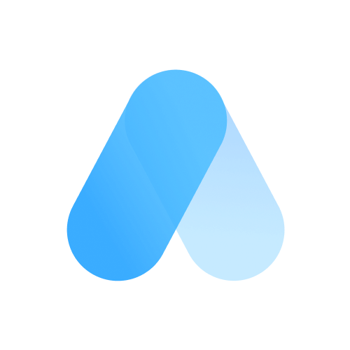

  

<h3 align="center">Atenas UI</h3>

  Framework de Componentes do design system Convert Company, Open Source
   
  <a href="https://atenas.convert.app.br/docs/installation"><strong>Explorar Documentação »</strong></a>
   
   
  <a href="https://atenas.convert.app.br/docs/components">Componentes</a>
  ·
  <a href="https://atenas.convert.app.br/docs/css">Tema</a>
  ·
  <a href="https://atenas.convert.app.br/docs/layout">Utils</a>

## 🚀 Começando com Atenas
Para adicionar o atenas ao seu projeto é muito simples, você pode seguir as seguintes maneiras :

- [Download da ultima versão](https://atenas.convert.app.br/docs/installation/#download)
- Clonar o repositório: `git clone https://github.com/convertcompany/atenas-ui.git`

## 🛠 Build customizado
Você pode fazer o seu proprio build do atenas, para isso é necessário seguir os seguintes passos :
- Clonar o repositório: `git clone https://github.com/convertcompany/atenas-ui.git`
- Instalar o pacote do less com `npm install`
- Acessar o source atenas-ui.less e realizar as modificações desejadas.
- Executar o build com `npm run build`
- O passo anterior irá exportar os arquivos novos na pasta dist/
- Pronto!

## 📚 Docs
- [Instalar](https://atenas.convert.app.br/docs/installation)
- [Customizar Tema](https://atenas.convert.app.br/docs/css/#theme)
- [Modo Dark](https://atenas.convert.app.br/docs/css/#darkmode)
- [Components](https://atenas.convert.app.br/docs/components)
- [Layout / Utils](https://atenas.convert.app.br/docs/layout)

## 😎 Feito com Atenas
- [Extensão Convert Click2Call](https://chrome.google.com/webstore/detail/convert-click2call/ibknofmdcbgmgadmdidenjifmphdjkog?hl=pt-br)

## ⚡️ O Projeto Atenas
O Atenas UI é um framework de UI desenvolvido pela Convert® Company, seguindo as regras do design system Convert®, e é distribuido gratuitamente para uso, saiba mais sobre nossa empresa :

#### [🌍 Convert Company](https://convertcompany.com.br)
- Telefone - <a href="tel:+555421037000">+55 54 2103700</a>
- WhatsApp - [+55 54 2103700](https://wa.me/555421037000)  
- Email - [dev@convertcompany.com.br](mailto:dev@convertcompany.com.br)

## 🇧🇷 Feito no Brasil
#### Copyright© - Convert Company 2022  
Titanium Tower, Sala 801 - Passo Fundo, RS - Brasil